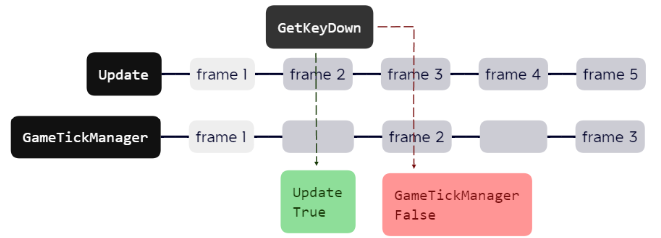

# HowToUse

## 1 Create Manager Object

1.1 Create a new gameObject

1.2 Add GameTickManager Script

1.3 Setting with inspector

--- 
## While Coding

1. Create New Script from Assets/Create/NaiveAPI/C# Tick Script

2. Setting update frequency

Change tickUpdate.Subscribe()'s param.
Default is Update TickRate.

--- 
## If you want to add ITickUpdate by yourself...

1. Add Interface “ITickUpdate”.

2. Coding in TickUpdate() (same as in Update()).

3. Subscribe to GameTickManager at Start().
    Do  not  invoke  this  in  Start()  if  you  can't ensure that
    this Awake is always slower than GameTick's Manager

--- 
## Things you have to know

Do not use(Input.GetKey(KeyCode.Mouse0))  it make many problem
Use this to replace it.

You can use tickUpdate.UnSubscribe() to stop update this script,
also can restart by use Subscribe() again.
