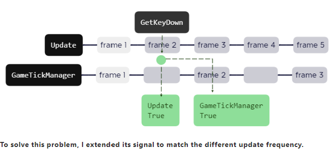

# Notice

## Why GetKey make problem in GameTickSystem

GetKeyDown() & GetKeyUp() change value in only one frame,
And GameTickManager doesn’t update with Unity’s Update(),
Than it will return the wrong value. (Actually is the value we don’t want)

--- 

To solve this problem, I extended its signal to match the different update frequency.
( Also the custom frequency, that’s most annoying )

--- 
So when you need to use Input.GetKey() use this instead.

