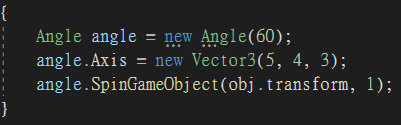

# SpinGameObject

## Methods

###  void SpinGameObject (  Angle Angle ),  Transform Transform )

###  void SpinGameObject (  this Angle this Angle ),  Transform Transform ),  float float )
Rotate the transform round towards the given angle 

## Example

