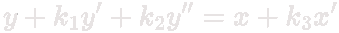

# SecondOrder

## Controller Equation

--- 
## Description

With this controller you can create lot of movement beheavior,
Easy to adjust by change value of F, Z, R, Spd.
    - F for Reflection frequency
    - Z for Error correction strength
    - R for Initial reflection direction
    - Spd as speed weight

--- 
## Properties

|Type|Name|Get|Set|Usage|
|:-:|:-:|:-:|:-:|:-:|
|float|F|   ■||paramter for controller|
|float|Z|   ■||paramter for controller|
|float|R|   ■||paramter for controller|
|float|K1|   ■||weight for equation|
|float|K2|   ■||weight for equation|
|float|K3|   ■||weight for equation|
|float|TwoPiF|   ■||return 2*PI*F|
|float|D|   ■||return TwoPiF * Sqrt(Abs(Z * Z - 1))|
|float|NowY|   ■||value position now|
|float|Velocity|   ■||as value of y delta|
|float|Target|   ■||target value|

--- 
## Methods

###  void Init ( 

###  float Update ( 

###  Texture2D GetGraph ( 

###  SecondOrderController Copy ( 

