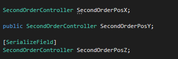
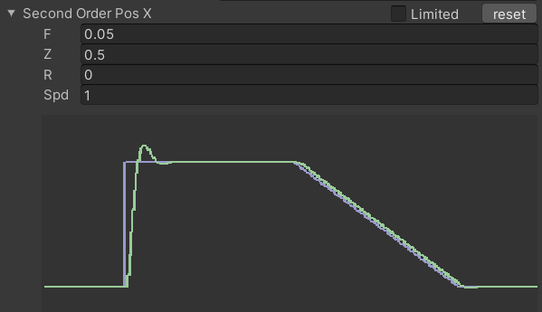
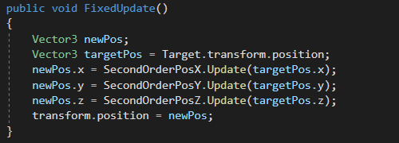

# HowToUse

In this sample we use controller to control 
GameObject's position.

You can also check it in the exsample scene.

--- 
## 1. Creat Controller in Your Script

Mark it public or use SerializeField will allow you 
to edit parameters in the inspector simpler.

Inspector

Click up Limited will allow you to edit parameter 
more easier. It will change field into slidebar.

--- 
## 2. Create Target Value

If you want to track other objects, you can just
use their transform value, or you can  create  a
variable to tell it where to go.

--- 
## 3. Calling Update Function

With this code, the object will follow target object
with performance you want. We calling it in Fixed-
Update to ensure it Update in a stable frequence.

