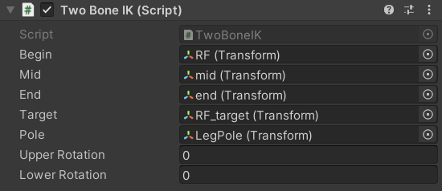
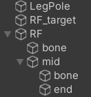

# TwoBoneIK

## Description

 A MonoBehaviour script for simple two bone IK problen.

You can checkout  the  example  code  for multi-legged 
creature in the example scene.

--- 
## Setup

|Begin|1st bone's root|
|:-:|:-:|
|Mid|point between 2 bones|
|End|2nd bone's root|
|Target||
|Pole|define spin plane (Pole & Target & Begin)|
|Upper Rotation|bone betwen begin and mid's rotation|
|Lower Rotation|bone betwen mid and end's rotation|

--- 
GameObject struct in picture above.

