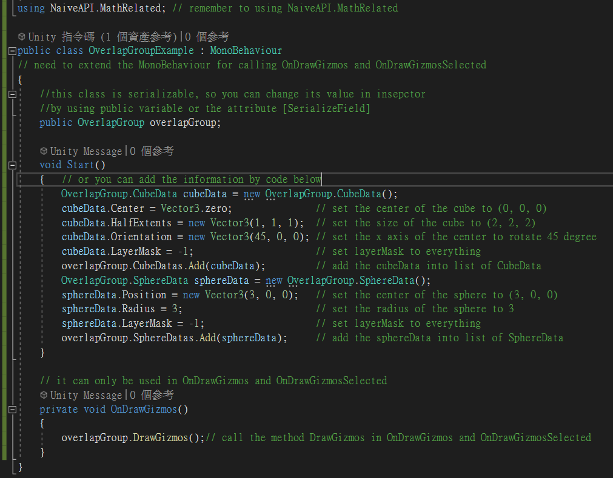
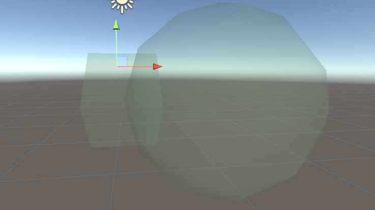

# DrawGizmos

## Description

Draw the gizmos in the scene with the information of the cubes 
and spheres in CubeDatas and SphereDatas.
This function can only be used in OnDrawGizmos and OnDrawGizmosSelected.
## Example

