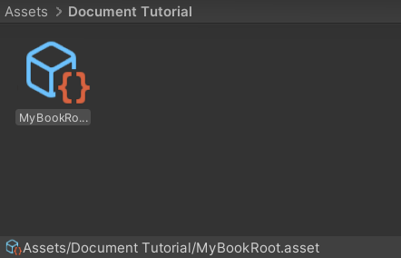

# 1_CreateBookRoot

## 1.1 Create Your Book Root

You can skip this step if you want to put your document below mine.

Create SODocInformation as BookRoot
( Assets / Create / Naive API / Document Information )

--- 
## 1.2 Add it to the DocBookList

( Edit / Project Settings / DocumentBuilder Settings)

--- 
## 1.3 Now you can found it in Book selection menu

