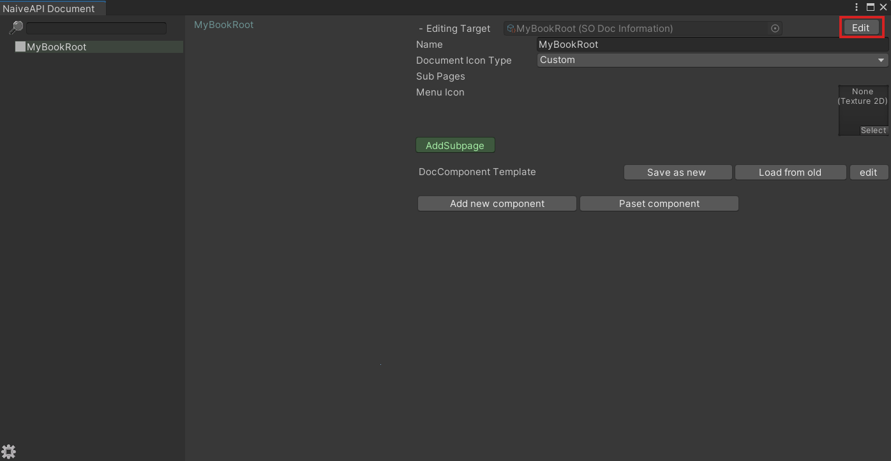
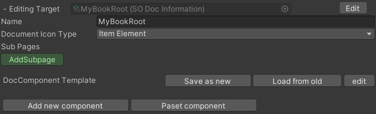
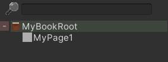

# 2_CreateSubPage

## 2.1 Select your Book and change into Edit Mode

--- 
## 2.2 Edit Mode will show you all elements can edit.

it's same with ScriptableObject's Inspector. So you can also 
edit it on Inspector,  but in this  window is more  convenient.

|Editing Target|The ScriptableObject asset that you are editing.|
|:-:|:-:|
|Name|Little title display at UpLeft|
|Document Icon Type|Little icon display in left Menu|
|Sub Pages|Will show it's subpage in left Menu|

--- 
## 2.3 Click AddSubpage button

Now you can select exist document or use Auto Create

- Exist document
       Create DocInformation in same way as create BookRoot
       and select or drag it into field.

- AutoCreate
       Click AutoCreate and name the new page. If the name is
       not allow,  you will  not be  able to  click "Create" button.
       It will auto create SubFolder in editing target's folder and
       generate asset in it.

Now it will appear in menu
