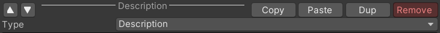

# 3_EditInformation

## Description

DocInformation is construct by many DocComponent.
You can add  as  many as  you  want.

You can checkout DocComponent type's detail in the next part.

--- 
## Add New DocComponent

Just use Add or Paste, 
but notice that you can't Paste before Copy

--- 
## Basic Edit Function

|▲ & ▼|Change the sort order of components|
|:-:|:-:|
|Copy|Copy this component into System Clipboard|
|Paste|Paste component from System Clipboard|
|Dup|Duplicate this component|
|Type|Select this component's type|

--- 
## DocComponent Template


After creating some general component structures, 
you can store  them  as  Templates,  which can be 
called directly in the future.

|Save as new|Save this component structures|
|:-:|:-:|
|Loas from old|Load structures saved before|
|edit|You can delete useless Template here|

