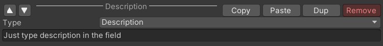
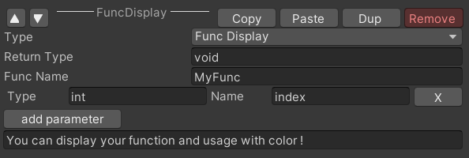
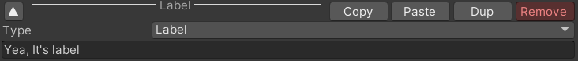
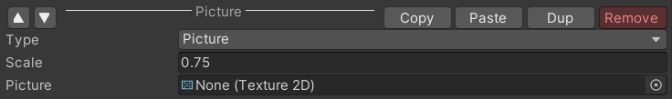
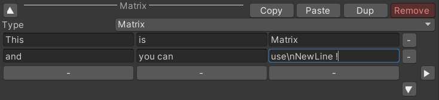
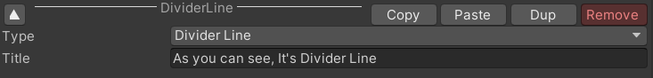

# 4_DocComponent

## Description

Here will show you every Types od DocComponent
the picture is layout in EditMode, and below is the result.

--- 

Just type description in the field

--- 

###  void MyFunc (  int int )
You can display your function and usage with color !

--- 

## Yea, It's label

--- 

Notice that if you want to display picture,
you need to set Texture Type into Sprite
and Resize Algorithm to Bilinear.

--- 

|This|is|Matrix|
|:-:|:-:|:-:|
|and|you can|use NewLine !|

--- 

--- 

